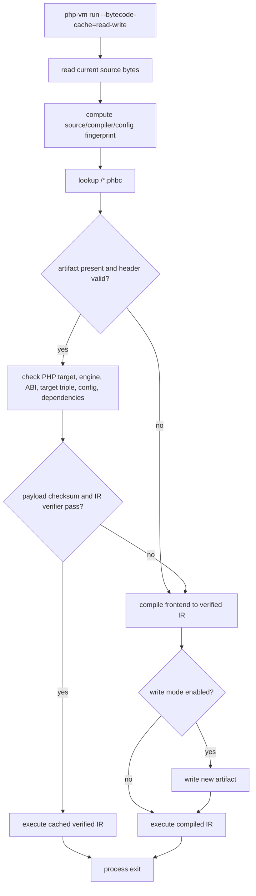
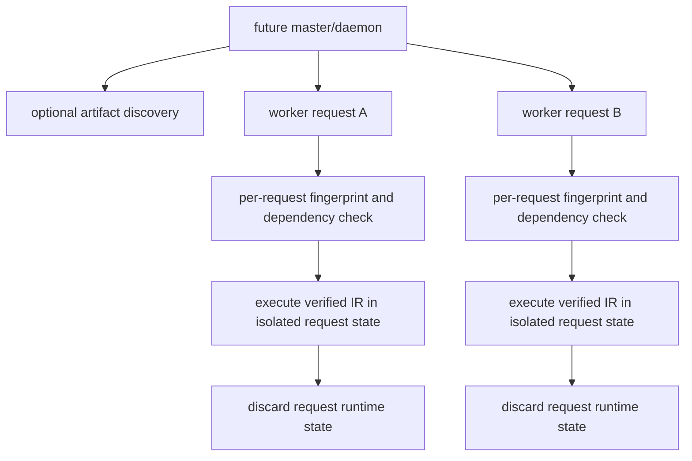
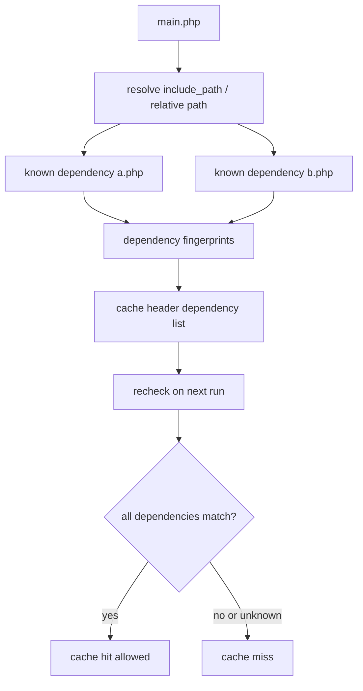
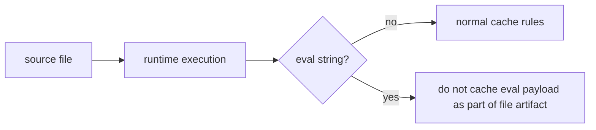

# Performance Bytecode Cache Follow-up

Performance bytecode-cache work starts from
`docs/adr/0072-bytecode-cache-format.md`. The design is intentionally narrower
than PHP Opcache: it defines a local, versioned, untrusted artifact format for
faster repeated frontend and IR loading. It does not define shared memory,
runtime state serialization, Zend ABI compatibility, or production SAPI
lifecycle behavior.

## Implementation Order

1. Add `php_bytecode_cache` with metadata-only header serialization.
2. Cover magic bytes, version mismatch, PHP target mismatch, corrupt input, and
   unknown future format tests.
3. Add deterministic CLI or fixture smoke coverage that reads and rejects cache
   metadata without changing VM semantics.
4. Add IR or bytecode payload support only after verifier-backed load checks are
   wired in.
5. Add cache hit/miss reporting and A/B validation against the no-cache path.

## Required Metadata

Every artifact header must describe the compatibility boundary before payload
decode:

| Field | Required Performance behavior |
| --- | --- |
| Engine version | Reject incompatible writers. |
| PHP target version | Accept only `8.5.7`. |
| Source fingerprint | Recompute from current source before use. |
| Compiler fingerprint | Cover parser, semantic, IR, feature, and opt-level inputs. |
| ABI/cache format version | Reject unsupported versions and unknown future versions. |
| Endianness and target triple | Reject unsupported platform assumptions. |
| INI/config fingerprint | Miss when compile/runtime-influencing config differs. |
| Dependency list | Use known include dependencies only; miss on incomplete dynamic dependencies. |

## Safe Deserialize Rules

- Treat the artifact as untrusted input.
- Check magic and bounded lengths before allocation.
- Check checksums before decoding nested metadata or payload bytes.
- Decode enum tags and strings strictly.
- Reject unknown critical fields.
- Never deserialize raw pointers, resources, closures, or host handles.
- Verify IR or bytecode payloads before execution.
- Convert all invalid artifacts to structured load errors or cache misses.

## Invalidation Rules

Cache lookup must miss if source bytes, dependency fingerprints, dependency
resolution, PHP target version, engine version, ABI version, format version,
feature flags, optimization level, target triple, or relevant INI/config values
change. Dynamic includes, eval, and autoload-sensitive dependencies remain cache
misses unless later work items add precise dependency tracking.

## Request and Cache Lifecycle

The Performance cache lifecycle is request-local at execution time and
disk-backed for `php-vm run` by default (see "Default-On CLI Behavior" below).
Cache hits may skip frontend-to-IR work, but they must not skip current
fingerprint checks, target checks, dependency checks, payload checksums, or IR
verification.

### Default-On CLI Behavior

`php-vm run` defaults to `--bytecode-cache=read-write` with a per-user cache
directory resolved in this order:

1. `PHRUST_BYTECODE_CACHE_DIR` (empty value disables the default location)
2. `$XDG_CACHE_HOME/phrust/bytecode`
3. `$HOME/.cache/phrust/bytecode`

When no writable location resolves, the run behaves as a cache miss with the
cache disabled. Overrides and escapes:

- `PHRUST_BYTECODE_CACHE=off|read|write|read-write` changes the default mode.
- Explicit `--bytecode-cache=...` / `--bytecode-cache-dir <path>` always win.
- `--engine-preset=baseline` runs fully uncached so the compatibility oracle
  keeps exercising the cold pipeline.
- Repository gates run with a repo-local cache directory and the
  persistent-feedback default disabled (exported centrally in the `justfile`)
  so committed baselines stay deterministic and the user cache is never
  polluted by gate traffic.

Alongside the cached unit, `php-vm run` maintains an advisory
persistent-feedback sidecar (`<digest>.pfbk`, format
`phrust-persistent-feedback-v1`) in the same directory. It records quickening
sites that finished the run specialized or blacklisted, and the next run with a
matching feedback fingerprint seeds its quickening table from it. Seeded
specializations keep the full runtime guard/fallback protocol, so stale or
wrong feedback can only cause guard misses and dequickening, never a semantic
change. `PHRUST_PERSISTENT_FEEDBACK=off` disables the sidecar;
`--persistent-feedback-read`, `--persistent-feedback-write`, and
`--persistent-feedback-stats-json` give explicit control. Entries are validated
against source fingerprint, engine version, PHP target, compile options, IR
fingerprint, epochs, and target before use; anything stale or corrupt falls
back to a cold start.

### One-Shot CLI Process

A single CLI run with the cache disabled compiles and executes exactly like the
baseline VM path. No cache artifact is read or written.


Lifecycle rules:

- The process owns all runtime state for the duration of one invocation.
- Runtime values, resources, globals, output buffers, and diagnostics are not
  serialized into the cache.
- Parse, semantic, IR, and runtime diagnostics remain observable on the normal
  path.

### Repeated CLI Execution with Disk Cache

Repeated CLI runs may reuse a disk artifact when all compatibility metadata and
fingerprints match. A miss or load error falls back to the normal compile path
and may write a replacement artifact if the selected mode permits writes.



Lifecycle rules:

- Cache artifacts are untrusted input even when they were written locally.
- A corrupt or stale artifact is a miss/load error, not a hard failure for
  normal execution.
- Cache stats are diagnostics only and must not change stdout.
- The cache key intentionally covers optimization level and compile/runtime
  configuration that can change semantics or generated IR.

### Future Daemon or FPM-Like Process

Performance does not implement a daemon, worker pool, shared-memory cache, FPM SAPI,
or production request manager. Later layers can reuse the same artifact and
fingerprint rules, but they must add their own process-lifetime and invalidation
contracts.



future runtime follow-up requirements:

- Define whether workers share cache metadata, payload bytes, or neither.
- Define cross-request invalidation when files change while workers are alive.
- Define request-state cleanup for globals, statics, resources, output buffers,
  INI overrides, autoload registrations, and error handlers.
- Define whether daemon startup may warm artifacts without executing user code.
- Keep Performance disk artifacts optional and safely ignorable.

### Include and Require Dependencies

Include and require inputs are part of the cache contract only when their
resolved dependency set is known. The dependency list must describe resolved
paths, source fingerprints, and resolution mode. Missing or incomplete
dependency information blocks reuse.



Performance can cache simple source files that have no dynamic include dependency
set. Include-heavy programs remain conservative unless the writer can prove a
complete dependency list. Later include invalidation work should cover
`include_path`, working directory, symlink/canonical path behavior, failure
diagnostics, and dynamic include expressions.

### Eval Exclusion

`eval` creates source text at runtime. Performance cache artifacts must not claim
that eval-created code is covered by the original source fingerprint.



Eval rules:

- Do not serialize eval-generated IR into a file artifact for the enclosing
  source.
- Do not treat eval strings as stable dependencies unless a later layer defines
  a separate eval cache key and diagnostics model.
- If eval can affect declarations, globals, or control flow for the request, the
  enclosing artifact must remain conservative.

## Autoload and Composer Fixtures

Composer-style autoload behavior is dependency-sensitive because the executed
files depend on registered autoloaders, include paths, generated class maps,
PSR-4 prefix maps, and filesystem layout. Performance treats autoload-sensitive
programs conservatively:

- If an artifact contains a complete, fingerprinted view of the relevant
  Composer metadata and resolved loaded files, it may be reused.
- If autoload resolution depends on runtime registration order, user code,
  generated files, or environment-specific paths that are not in the header, the
  cache must miss.
- Composer fixture tests should keep the cache disabled or expect misses until
  the dependency model records `vendor/autoload.php`, class maps, included
  package files, and generated metadata fingerprints.
- Autoload registrations are request runtime state; they are not serialized into
  a Performance artifact.

## Boundaries Compared with PHP OPcache

The Performance cache is deliberately not a production PHP OPcache replacement.

- No shared-memory OPcache manager is required in Performance.
- No preloading support is required in Performance.
- No production SAPI lifecycle, FPM worker manager, or cross-request shared
  runtime state is required in Performance.
- No Zend ABI, extension persistence, interned-string table, class-entry sharing,
  or host resource persistence is required in Performance.
- The disk cache is an optional local optimization. A program must still execute
  correctly when the cache directory is absent, empty, stale, corrupt, or
  cleared.

## Developer Workflow

Build the VM and run a cached fixture manually:

```bash
nix develop -c cargo build -p php_vm_cli --bin php-vm
nix develop -c target/debug/php-vm run \
  --bytecode-cache=read-write \
  --bytecode-cache-dir target/performance/manual-cache \
  --bytecode-cache-stats \
  tests/fixtures/performance/bytecode_cache/simple.php
```

Clear only `.phbc` artifacts in that cache directory:

```bash
nix develop -c target/debug/php-vm run \
  --bytecode-cache=off \
  --bytecode-cache-dir target/performance/manual-cache \
  --clear-bytecode-cache \
  tests/fixtures/performance/bytecode_cache/simple.php
```

Run the cache gates:

```bash
nix develop -c just cache-fingerprint-smoke
nix develop -c just cache-roundtrip
nix develop -c just safety-audit-smoke
nix develop -c just verify-performance
```

`cache-roundtrip` covers fingerprint changes, verifier-backed payload loading,
corrupt payload fallback, CLI source-change misses, opt-level misses, non-hex
digest path-component rejection, and read/write hit behavior.

## Troubleshooting

- Unexpected miss: rerun with `--bytecode-cache-stats`, inspect the JSON written
  to stderr, and check source, opt-level, target, engine version, feature flags,
  and config dimensions.
- Compile failure: `--bytecode-cache-stats` marks `compile_error: true` before
  normal frontend diagnostics are written. Compile failures are never stored.
- Corrupt artifact: normal CLI execution should fall back to compile-from-source
  and report `load_error` in cache stats. Reproduce with
  `cargo test -p php_bytecode_cache corrupt`.
- Path traversal concern: cache filenames are derived from hex digests only.
  `cargo test -p php_vm_cli bytecode_cache` includes a non-hex digest rejection
  test.
- Include/autoload staleness: do not force cache hits for dynamic include or
  Composer/autoload programs until dependency fingerprints are complete; those
  are known gaps.

## Known Boundaries

- No cache hit may bypass parser, semantic, IR, or runtime diagnostics unless
  the artifact has a verifier-backed payload and all fingerprints match.
- Cache corruption must never be fatal to normal no-cache execution.
- Include/require invalidation, Composer/autoload dependency tracking,
  shared-memory OPcache behavior, preloading, and production SAPI lifecycle are
  future runtime-or-later follow-up topics unless a later Performance work item explicitly adds
  tested support.
